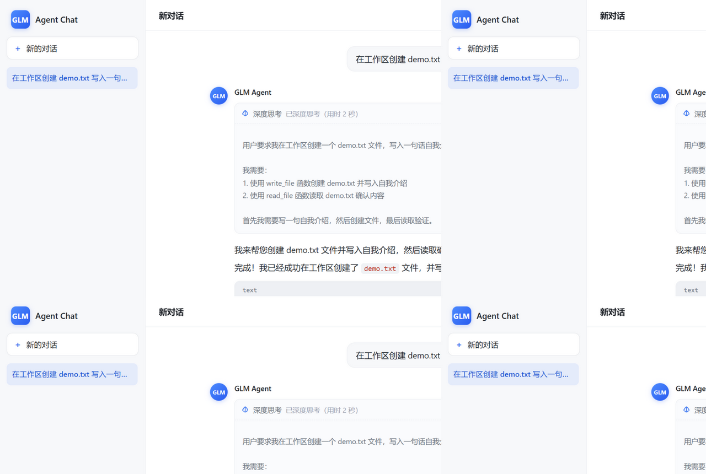
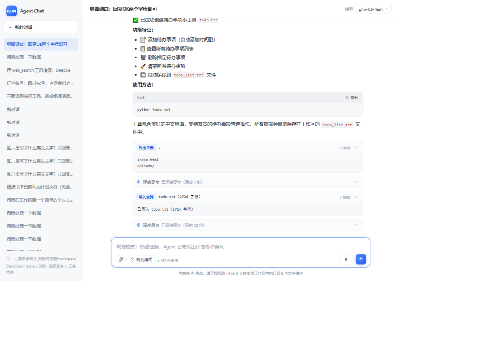

# GLM Agent Chat

一个 **DeepSeek-Harness 风格**的网页 Agent 对话框：界面参照 GLM 网页版，后端通过
GLM 开放平台（智谱 BigModel）的 OpenAI 兼容接口驱动 `glm` 系列模型，内置 Agent
工具循环（执行命令 / 读写文件），并实时展示**思考链（深度思考）**与**命令/工具调用过程**。

 





## 🧪 运行测试

```bash
python tests/fixtures_gen.py        # 生成测试夹具（需 pypdf/openpyxl/Pillow）
node tests/e2e.mjs                  # 全量 E2E（需服务已启动）
ONLY=T6 node tests/e2e.mjs          # 只跑某一组（T1~T6）
node tests/everyinfra_check.mjs     # everyinfra_data 工具自包含验证（本地 mock，无需服务/外网）
```

## ✨ 功能特性与验证状态

> 2026-10-09 功能验证：E2E 22/22 通过（`tests/e2e.mjs`，真实 API：glm-4.5-flash / glm-4v-flash）
> 2026-10-10 everyinfra_data：mock 全路径 12/12 通过 + E2E 22/22 回归无退化（真实调用待 EVERYINFRA_API_KEY 与网络）

| 功能 | 说明 | 状态 |
| --- | --- | --- |
| 💬 网页对话 | GLM 网页版风格，多会话侧边栏、Markdown/代码高亮、复制 | ✅ 已验证 |
| 🧠 思考链 | 流式 `reasoning_content`，折叠卡片 + 思考用时 | ✅ 已验证 |
| 🛠 命令/工具卡片 | `run_command` / `read_file` / `write_file` / `list_dir`，工作区沙箱 | ✅ 已验证 |
| 🧭 计划模式 | 规划回合无工具可调（阻塞），计划卡片确认后才执行 | ✅ 已验证 |
| 🖼 图片上传 | PNG/JPG/WEBP，≤5MB×4 张，`glm-4v-flash` 视觉理解，错误提示友好 | ✅ 已验证 |
| 📄 文件解析 | PDF（文本层，扫描件明确提示不支持 OCR）、Excel（多 sheet/公式值/合并单元格）、FASTA（序列统计）、CSV/TXT/MD/JSON | ✅ 已验证 |
| 🔁 多轮上下文 | 6 轮指代消解通过；>40 条自动截断中段（保留任务背景） | ✅ 已验证 |
| 🌐 联网查询 | `web_search` 工具，DDG→Bing 降级，10s 超时，结果可溯源 | ✅ 已验证 |
| 🧬 蛋白结构预测 | `protein_structure` 工具（NVIDIA BioNeMo ESMFold NIM 云端），PDB 自动落盘 | ✅ 已验证（降级路径；真实调用待 NVIDIA_API_KEY） |
| 🧫 生物医学子 agent | `biomni_task` 工具（Stanford Biomni，独立 venv 子进程沙箱，跳过 11GB 数据湖） | ✅ 链路已验证（免费模型下任务可能超时降级） |
| 🛰 数据平台接入 | `everyinfra_data` 工具（EveryInfra：86+ 平台采集 + 17 种搜索工具；目录免 key、异步任务轮询、分页、可选代理） | ✅ mock 12/12；真实调用待 key/网络 |
| ❓ 需求澄清 | 模糊需求输出 2-4 个互斥选项（单选/多选/自定义），先问后做 | ✅ 已验证 |
| 🗂 会话持久化 | 服务端 JSON 存储 | ✅ 已验证 |

## 🚀 快速开始

```bash
# 1. 安装 Node.js ≥ 18（无需 npm install，后端零依赖）

# 2. 配置 API Key
cp .env.example .env
# 编辑 .env，填入你的 GLM_API_KEY（https://open.bigmodel.cn 获取）

# 3. 启动
node server.js          # 或 npm start

# 4. 打开浏览器
# http://localhost:3210
```

## ⚙️ 配置说明（.env）

| 变量 | 默认值 | 说明 |
| --- | --- | --- |
| `GLM_API_KEY` | （必填） | 智谱开放平台 API Key |
| `GLM_BASE_URL` | `https://open.bigmodel.cn/api/paas/v4` | OpenAI 兼容接口地址（可换成 `https://api.z.ai/api/paas/v4`）。⚠️ GLM Coding Plan 订阅 key 无按量余额，请改用 `https://open.bigmodel.cn/api/coding/paas/v4`，否则付费模型报 429「余额不足或无可用资源包」 |
| `GLM_MODEL` | `glm-5.3` | 默认模型 |
| `GLM_MODELS` | `glm-5.3,glm-4.6,...` | 界面可切换的模型列表 |
| `PORT` | `3210` | 服务端口 |
| `GLM_VISION_MODELS` | `glm-4v-flash,glm-4.5v,glm-4.6v` | 支持图片输入的视觉模型 |
| `IMAGE_MAX_BYTES` | `5242880` | 单张图片大小上限 |
| `UPLOAD_MAX_BYTES` | `10485760` | 文档上传大小上限 |
| `PDF_MAX_PAGES` | `30` | PDF 最大提取页数 |
| `XLSX_MAX_ROWS` | `200` | Excel 每 sheet 最大提取行数 |
| `MAX_ATTACHMENT_CHARS` | `8000` | 附件注入上下文的最大字符数 |
| `CONTEXT_WINDOW_MESSAGES` | `40` | 超过则截断中段历史 |
| `PYTHON_BIN` | `python` | PDF/Excel 解析所用 Python（需 pypdf、openpyxl） |
| `NVIDIA_API_KEY` | （空） | BioNeMo ESMFold 蛋白结构预测，免费注册：https://build.nvidia.com |
| `BIOMNI_PYTHON` | （空） | Biomni 独立 venv 内 python 的绝对路径 |
| `BIOMNI_MODEL` | `glm-4.5-flash` | Biomni 使用的模型（复用 GLM_API_KEY） |
| `BIOMNI_TIMEOUT_MS` | `300000` | Biomni 单任务超时 |
| `EVERYINFRA_API_KEY` | （空） | EveryInfra 数据平台 key（console 兑换额度码后创建，`sk-` 开头） |
| `EVERYINFRA_BASE_URL` | `https://api.everyinfra.com` | API 地址（一般不用改） |
| `EVERYINFRA_TIMEOUT_MS` | `30000` | 单次请求超时 |
| `EVERYINFRA_JOB_MAX_WAIT_MS` | `120000` | 异步任务最长等待，超时后可 `kind=job` 续查 |
| `EVERYINFRA_PROXY` | （空） | 可选代理（内置 CONNECT 隧道，零依赖），见下方 EveryInfra 章节 |
| `AGENT_MAX_STEPS` | `8` | 单轮对话最大工具调用步数 |
| `CMD_TIMEOUT_MS` | `30000` | 单条命令超时 |
| `MAX_TOOL_OUTPUT` | `6000` | 工具输出最大字符数（超出截断） |

## 🧫 Biomni 集成（可选）

`biomni_task` 工具需要独立 venv（避免与主环境依赖冲突）：

```bash
python -m venv biomni-venv
biomni-venv/Scripts/python -m pip install biomni pandas langchain_openai tqdm
# 然后在 .env 中配置：
# BIOMNI_PYTHON=<绝对路径>/biomni-venv/Scripts/python.exe
```

沙箱设计：子进程运行、cwd 锁定 `workspace/biomni`、跳过 11GB 数据湖、300s 超时由父进程终止。
注意：Biomni 会执行 LLM 生成的代码，生产环境建议进一步容器化；免费 flash 模型下任务可能不收敛（会如实返回过程日志，主 Agent 会自动降级接管）。

## 🛰 EveryInfra 数据平台接入（可选）

`everyinfra_data` 工具接入 [EveryInfra](https://everyinfra.com)：86+ 平台的公开数据采集
（小红书 / 抖音 / B站 / 知乎 / 微博 / 淘宝 / TikTok / YouTube / Reddit 等）与 17 种联网搜索工具
（web / news / scholar / semantic / crawl / read / crosscheck 等）。

| kind | 说明 | 是否需要 key |
| --- | --- | --- |
| `catalog` | 查平台列表 / 某平台的动作与计价 / 搜索工具列表 | 免 key |
| `social` | 平台数据采集（`platform` + `action` + `params`） | 需要 |
| `search` | 搜索工具（`tool` + `params`） | 需要 |
| `job` | 查询异步任务结果（`job_id`，等待超时后续查） | 需要 |

行为要点：完整 JSON 自动落盘 `workspace/everyinfra/`，工具输出返回摘要预览；
响应含 `next_page_token` 时提示模型翻页；202 异步任务自动轮询（每 2s，默认上限 120s）；
未配 key / key 无效 / 额度不足 / 限流 / 网络不可达均有面向用户的友好报错。

开通步骤：

1. 到 [console.everyinfra.com](https://console.everyinfra.com) 注册（邮箱 + 密码）
2. Billing 页兑换额度码（关注官方 WeChat 获取，**24 小时内有效**）→ 创建 API key（`sk-` 开头）
3. `.env` 中填 `EVERYINFRA_API_KEY=sk-...` 后重启服务

> ⚠️ 网络说明：`api.everyinfra.com` 在部分网络环境（如境内直连）不通。若工具报
> 「网络请求失败」，在 `.env` 配置 `EVERYINFRA_PROXY=http://127.0.0.1:<本机代理端口>`
> 后重启服务即可（内置 HTTP CONNECT 隧道实现，零依赖，常见端口：Clash Verge 7897 /
> Clash 7890 / v2rayN 10809）。

> 模型可用性取决于账号余额/资源包：`glm-5.3` 等旗舰模型需要充值；
> `glm-4.5-flash`、`glm-4-flash` 通常有免费额度，可用于体验完整功能（含思考链）。

## 🏗 架构

```
浏览器                     server.js（Node, 零依赖）
┌──────────────┐   HTTP/SSE  ┌─────────────────────────────┐
│ public/      │ ──────────► │ /api/chat  Agent 循环(harness)│
│  index.html  │             │   ├─ GLM chat/completions    │──► GLM 开放平台
│  app.js      │ ◄────────── │   │   (stream + reasoning)   │     (glm-5.3)
│  style.css   │  reasoning/ │   ├─ 工具执行                 │──► 本地 workspace/
│  vendor/     │  content/   │   │   run_command / file io  │
│  (marked+hljs)│ tool_call…  │   └─ 多步循环 (max 8)        │
└──────────────┘             │ /api/conversations 会话存储   │──► data/conversations.json
                             │ 静态文件服务                  │
                             └─────────────────────────────┘
```

一次提问的完整链路：

1. 前端 `POST /api/chat`，建立 SSE 连接
2. 服务端带着系统提示与工具定义请求 GLM（`stream: true`）
3. `reasoning_content` 增量 → 前端"深度思考"卡片流式展开
4. 模型发起 `tool_calls`（如执行命令）→ 服务端在 `workspace/` 中执行 → 结果回传模型
5. 循环直到模型给出最终回答 → 前端 Markdown 渲染

## 🔒 安全说明

- API Key 只存在于 `.env`（已被 `.gitignore` 忽略），前端只拿到"已配置"状态
- 文件工具做了**工作区路径限制**，不能读写 `workspace/` 之外的文件
- `run_command` 在 `workspace/` 目录下执行，超时 30s，输出截断
- 会话数据保存在 `data/`（不入库）

## 📜 License

[MIT](LICENSE)
